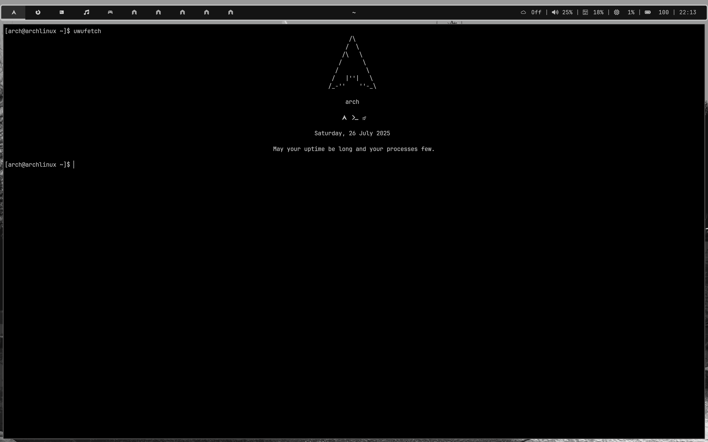

# uwufetch

A minimal and highly customizable system fetch for **Arch Linux** written in **Bash**

---



---

### Font

- JetBrains Mono Nerd Font

---

## Setup Guide

To install uwufetch on your system, follow these steps:

### Use installation script

```bash
wget https://raw.githubusercontent.com/ShadowNetter-Official/uwufetch/main/install.sh && sh install.sh
```

### Or install manually:

### 1. Install Font

```bash
sudo pacman -S ttf-jetbrains-mono-nerd
```
### 2. Clone This Repo

```bash
git clone https://github.com/ShadowNetter-Official/uwufetch
cd uwufetch
```

### 3. Install

```bash
chmod +x uwufetch
sudo cp uwufetch /bin/
```

---

## Configuration

You can configure uwufetch directly with:

```bash
sudo nano /bin/uwufetch
```

## Removing

You can remove uwufetch with:

```bash
sudo rm /bin/uwufetch
```

---

### Done :)

I hope you like it

### MIT License


Copyright (c) 2025 ShadowNetter-Official

Permission is hereby granted, free of charge, to any person obtaining a copy
of this software and associated documentation files (the "Software"), to deal
in the Software without restriction, including without limitation the rights
to use, copy, modify, merge, publish, distribute, sublicense, and/or sell
copies of the Software, and to permit persons to whom the Software is
furnished to do so, subject to the following conditions:

The above copyright notice and this permission notice shall be included in all
copies or substantial portions of the Software.

THE SOFTWARE IS PROVIDED "AS IS", WITHOUT WARRANTY OF ANY KIND, EXPRESS OR
IMPLIED, INCLUDING BUT NOT LIMITED TO THE WARRANTIES OF MERCHANTABILITY,
FITNESS FOR A PARTICULAR PURPOSE AND NONINFRINGEMENT. IN NO EVENT SHALL THE
AUTHORS OR COPYRIGHT HOLDERS BE LIABLE FOR ANY CLAIM, DAMAGES OR OTHER
LIABILITY, WHETHER IN AN ACTION OF CONTRACT, TORT OR OTHERWISE, ARISING FROM,
OUT OF OR IN CONNECTION WITH THE SOFTWARE OR THE USE OR OTHER DEALINGS IN THE
SOFTWARE.
